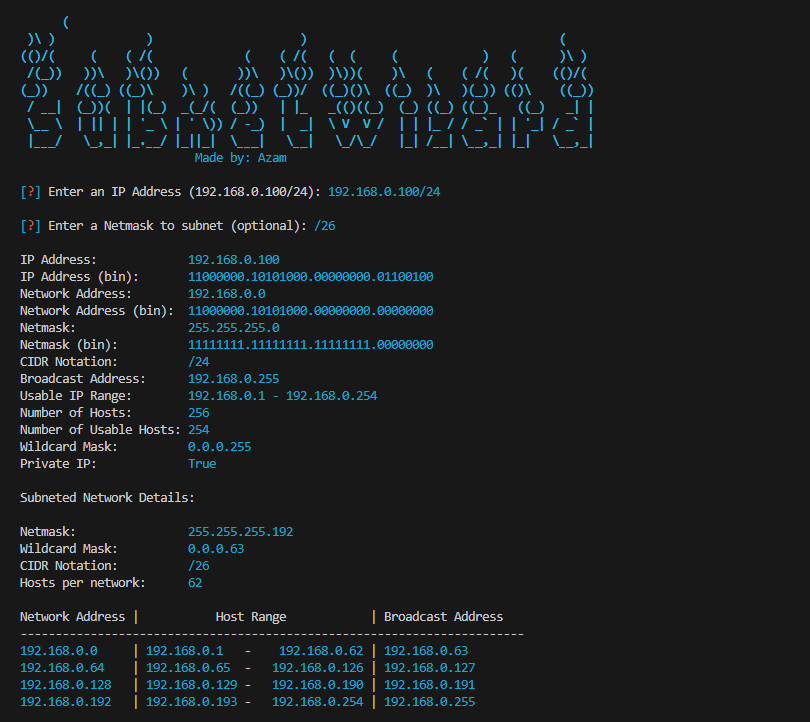

# 🌐 SubnetWizard

Welcome to SubnetWizard, your ultimate console-based subnet/supernet calculator! Whether you're a network administrator or a curious tech enthusiast, SubnetWizard is here to simplify your subnetting tasks with ease. Dive into its features and unleash the power of network calculations like never before.

## 🚀 Features
- Subnet any given network effortlessly.
- Calculate supernetting with precision.
- Obtain valuable information about IPv4 addresses.
- Compatible with both Linux and Windows environments.
- User-friendly CLI interface for seamless navigation.
- Utilizes Python's ipaddress module for accuracy.
- Works with Python 3.10.5 and above.

## 📋 Requirements
- Python 3.10.5 or above.

## 💡 User Manual
 **Installation**
1. Clone the repository:

 ```bash
   git clone https://github.com/naemazam/SubnetWizard.git
   ```

2. Navigate to the directory:

 ```bash
   cd SubnetWizard
   ```

**Usage**
1. Run the tool: 

Linux: 
 ```bash
   python3 main.py
   ```

Windows:
 ```bash
   python main.py
   ```

2. You can also use argument keys:
     - `-i` for the IP address to subnet/supernet.
     - `-s` for the netmask (binary or CIDR).

3. For Help, use:

 ```bash
   python3 main.py --help
   ```
   
Example Subnetting: 
 ```bash
   python3 main.py -i 192.168.0.100/24 -s /26
   ```

## ❓ FAQ
**Q:** Can I use SubnetWizard on macOS?  
**A:** Currently, SubnetWizard supports Linux and Windows platforms.

**Q:** How accurate are the calculations?  
**A:** SubnetWizard utilizes Python's ipaddress module, ensuring precise subnetting and supernetting results.

## 🤝 Contribution
Contributions to SubnetWizard are welcome! Feel free to submit bug reports, feature requests, or even pull requests via GitHub.

## 📄 License
SubnetWizard is licensed under the MIT License. See the LICENSE file for details.

## 📸 Snapshot


Start subnetting and supernetting like a pro with SubnetWizard! Happy networking!
